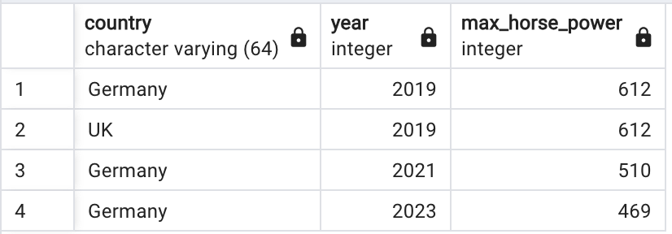

# Python: 3 Formas de trabajar con bases de datos SQL, ORM y Query Builder

Explora tres enfoques diferentes para trabajar con bases de datos usando Python como intermediario:

1. **SQL**: Consultas directas escritas en SQL.
2. **ORM (Object Relational Mapping)**: Mapeo Objeto-Relacional. 
3. **Query Builder**: Constructores de consultas SQL.

Este proyecto surge con el objetivo de comprobar que tan funcional es cada una de estas opciones gracias al artículo [Python — 3 Ways to Work with Databases (SQL, ORM, Query Builder)](https://blog.stackademic.com/python-3-ways-to-work-with-databases-sql-orm-query-builder-e2a2d3cbe437) de [Ihor Lukianov](https://lukianovihor.medium.com/). Quien nos muestra cómo trabajar con bases de datos usando SQL, ORM y Query Builder en Python.

Se usa como motor de base de datos PostgreSQL y se crea una tabla a partir de las siguientes líneas de código, las cuales están explicadas en este [artículo](https://lukianovihor.medium.com/sql-order-of-query-execution-8c7cd926400):
 
```sql
DROP TABLE IF EXISTS cars, engines;
CREATE TABLE cars (
 manufacturer VARCHAR(64),
 model VARCHAR(64),
 country VARCHAR(64),
 engine_name VARCHAR(64),
 year INT
);
CREATE TABLE engines (
 name VARCHAR(64),
 horse_power INT
);

INSERT INTO cars
VALUES 
 ('BMW', 'M4', 'Germany', 'S58B30T0-353', 2021),
 ('BMW', 'M4', 'Germany', 'S58B30T0-375', 2021),
 ('Chevrolet', 'Corvette', 'USA', 'LT6', 2023),
 ('Chevrolet', 'Corvette', 'USA', 'LT2', 2023),
 ('Audi', 'R8', 'Germany', 'DOHC FSI V10-5.2-456', 2019),
 ('McLaren', 'GT', 'UK', 'M840TE', 2019),
 ('Mercedes', 'AMG C 63 S E', 'Germany', 'M139L', 2023);
 
INSERT INTO engines
VALUES 
 ('S58B30T0-353', 473),
 ('S58B30T0-375', 510),
 ('LT6', 670),
 ('LT2', 495),
 ('DOHC FSI V10-5.2-456', 612),
 ('M840TE', 612),
 ('M139L', 469);
```

Posteriormente se procede a ejecutar esta consulta en cada uno de los tres enfoques mencionados anteriormente:

```sql
SELECT
  cars.manufacturer
  , cars.model
  , cars.country
  , cars.year
  , MAX(engines.horse_power) as maximum_horse_power
FROM cars
JOIN engines
 ON cars.engine_name = engines.name
WHERE cars.year > 2015 AND cars.country = 'Germany'
GROUP BY cars.manufacturer, cars.model, cars.country, cars.year
HAVING MAX(engines.horse_power)> 200
ORDER BY maximum_horse_power DESC
LIMIT 2
```

Lo cual debe arrojar el siguiente resultado:



Para llevar a cabo este proyecto se utilizó el siguiente entorno de desarrollo:

- **Python 3.9.6**
- **PostgreSQL 16.3**
- **psycopg2-binary 2.9.9**
- **python-dotenv 1.0.1**
- **notebook 7.2.1**

Para instalar las dependencias necesarias se puede ejecutar el siguiente comando:

```bash
pip install -r requirements.txt
```

